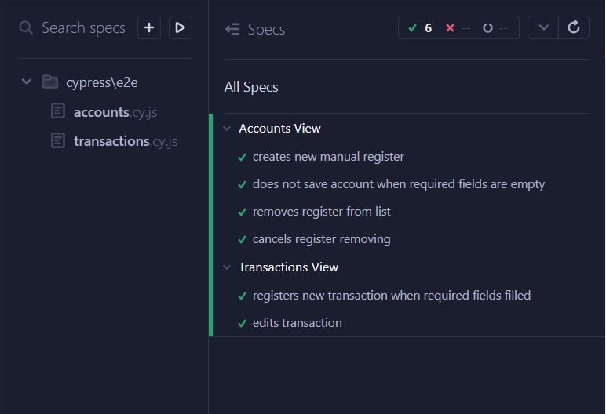
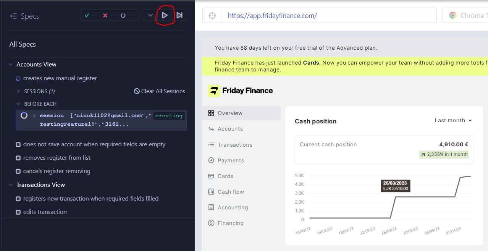
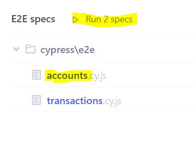

# QA Challenge

This repository contains UI tests for [Friday Finance website](https://www.fridayfinance.com/).
Documentation with all test scenarios can be found [here](https://cottony-bosworth-fff.notion.site/Friday-Finance-QA-Challenge-Nina-Sitaeva-1bf52e73bee14a8f9f20115acf426db4)

## Important:

Tests run in headed mode. Once login data is confirmed, _**running is paused**_ in order to check whether the verification code is needed.

> ❗❗❗ If it is not required (the main page is loaded), just **resume running**:

If code is required, please follow these steps:

1. Visit https://receive-smss.com/sms/31616294112/
2. Find message with digit code from Friday Finance.
3. Type digit code in appropriate field and confirm.
4. Once the user is authorized, resume tests running.

## To run tests:

1. Clone repository:  
   `git clone https://github.com/nina-si/friday-finance-test.git`
2. Move to project folder:  
   `cd friday-finance-test`
3. Install dependencies:  
   `npm install`
4. Run tests:  
   `npm run test`

This will run all the tests in headed mode (don't forget to resume running after authorization❗).

Or you can open _**Cypress GUI**_ by following these steps:

4. Run in terminal:
   `npx cypress open`
5. Choose E2E Testing
6. Choose preferred browser
7. Now you can run all specs at once or choose one of them:

