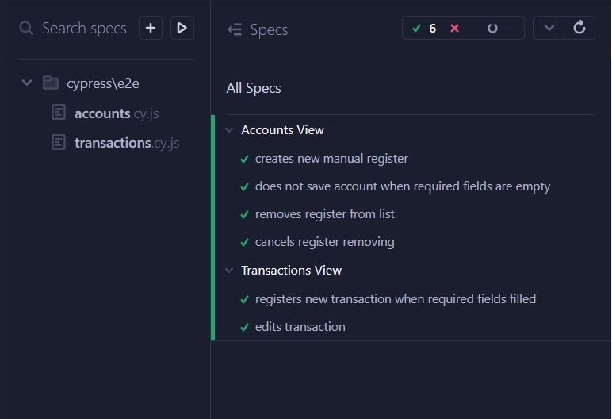
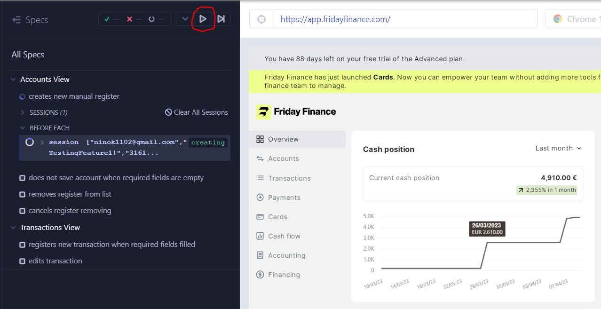
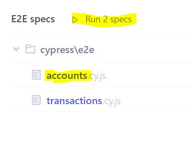

# Cypress e2e tests

This repository contains an example of UI tests for financial management web application.

## Folders

- File **`cypress.config.js`** contains global settings for e2e tests (base url, etc.).
- Folder **`e2e/`** contains test scenarios.
- Folder **`fixtures/`** includes test data.
- Folder **`support/`** contains:
  1. File **`commands.js`** - custom commands for Cypress.
  2. Folder **`repositories/`** - methods for getting UI elements on a specific pages/views.
  3. Folder **`actions/`** - methods for actions that can be reused across various test scenarios (methods like fill the specific form, etc.)
  4. Folder **`utils/`** - for some basic functions, like generating random string, and utils for intercepting graphQL requests.
- Folders **`videos/`** and **`screenshots/`** include testing artifacts.

## Important:

Tests run in headed mode. Once login data is confirmed, running is paused in order to check whether the verification code is needed.

> ❗❗❗ If it is not required (the main page is loaded), just **resume running**:

If code is required, please follow these steps:

1. Visit https://receive-smss.com/sms/31616294112/
2. Find message with digit code from Friday.
3. Type digit code in appropriate field and confirm.
4. Once the user is authorized, resume tests running.

## To run tests:

1. Clone repository:  
   `git clone https://github.com/nina-si/cypress-transactions-test.git`
2. Move to project folder:  
   `cd cypress-transactions-test`
3. Install dependencies:  
   `npm install`
4. Run all tests:  
   `npm run test`

This will run all the tests in headed mode (don't forget to resume running after authorization❗).

Or you can open _**Cypress GUI**_ by following these steps:

4. Run in terminal:
   `npx cypress open`
5. Choose E2E Testing
6. Choose preferred browser
7. Now you can run all specs at once or choose one of them:

